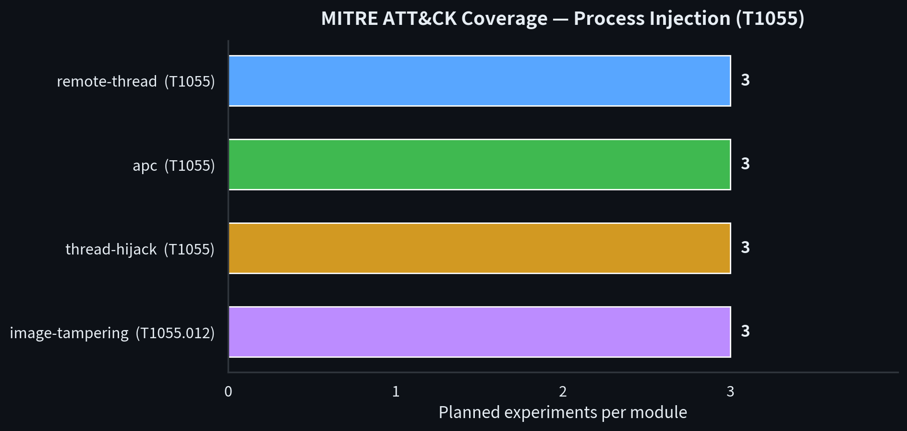
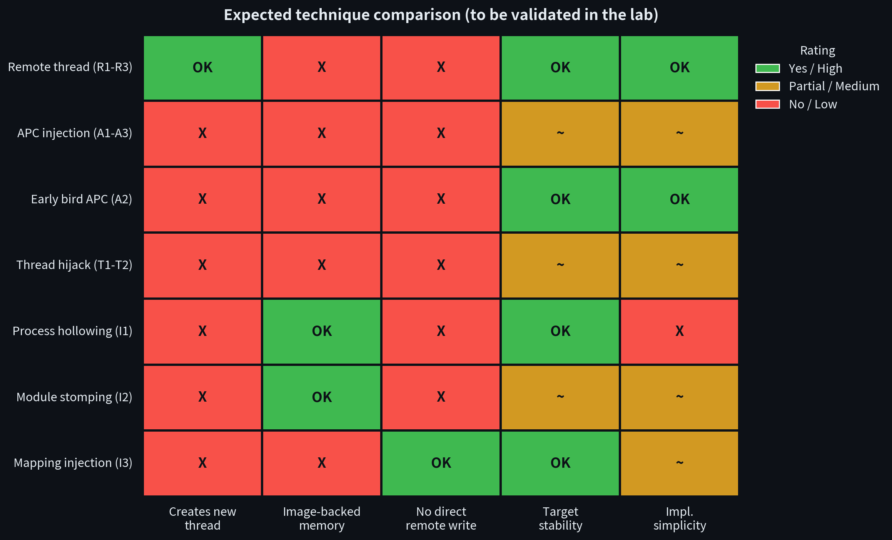
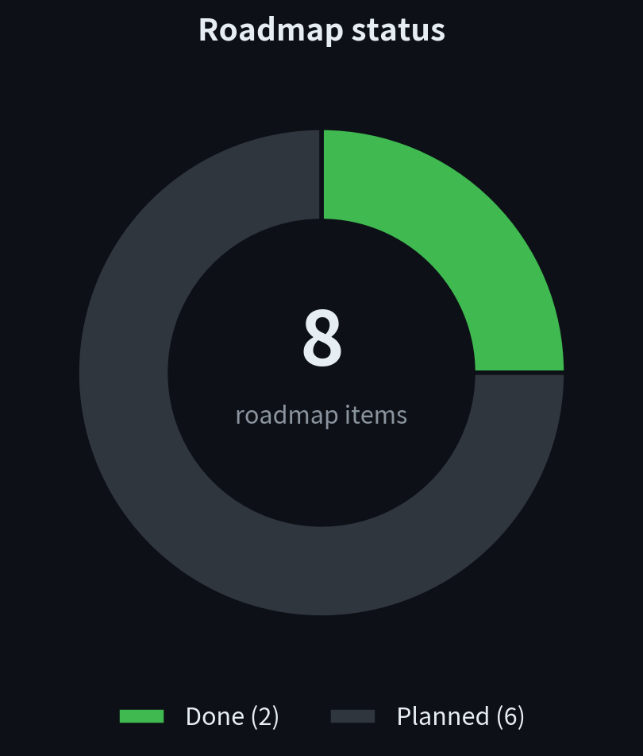

# process-injection-arsenal


> **⚠️ Disclaimer**
> This repository is an **offensive security research** project intended exclusively for **isolated labs** and **authorized operations** (red team engagements with contractual scope and signed Rules of Engagement). Using any technique documented here against systems without explicit authorization is a crime (Brazil — Lei nº 12.737/2012; United States — CFAA; equivalent legislation in other jurisdictions). The author assumes no liability for misuse.

## Objective

A structured study of **Process Injection** techniques ([MITRE ATT&CK T1055](https://attack.mitre.org/techniques/T1055/)) on Windows. Each technique is implemented as a lab PoC with the same harmless payload (MessageBox), allowing direct comparison of behavior, prerequisites, and artifacts.

## Table of Contents

- [Project structure](#project-structure)
- [Modules](#modules)
- [Lab](#lab)
- [Roadmap](#roadmap)
- [References](#references)

## Project structure

```
process-injection-arsenal/
├── docs/                       # Research notes per technique family
│   ├── remote-thread.md        # T1055 — CreateRemoteThread / NtCreateThreadEx
│   ├── apc-injection.md        # T1055 — QueueUserAPC, early bird, NtQueueApcThread
│   ├── thread-hijacking.md     # T1055 — Suspend/GetContext/SetContext/Resume
│   └── image-tampering.md      # T1055.012 — hollowing, module stomping, mapping
├── src/                        # Lab PoCs (see each module's README)
│   ├── remote-thread/
│   ├── apc/
│   ├── thread-hijack/
│   └── image-tampering/
├── lab/
│   └── setup.md                # Test environment setup
├── CONTRIBUTING.md
└── LICENSE
```

## Modules

| Module | ATT&CK | Techniques | Status |
|---|---|---|---|
| [`remote-thread`](src/remote-thread/) | T1055 | `VirtualAllocEx` + `WriteProcessMemory` + `CreateRemoteThread`, `NtCreateThreadEx` variant | 📋 planned |
| [`apc`](src/apc/) | T1055 | `QueueUserAPC`, early bird APC, `NtQueueApcThread` | 📋 planned |
| [`thread-hijack`](src/thread-hijack/) | T1055 | Suspend → `GetThreadContext` → `SetThreadContext` → Resume | 📋 planned |
| [`image-tampering`](src/image-tampering/) | T1055.012 | Process hollowing, module stomping, section mapping injection | 📋 planned |

## Payload convention

Every PoC executes the **same harmless payload**: a minimal shellcode that displays `MessageBoxA("process-injection-arsenal lab")`. This ensures a fair comparison across techniques and keeps the project clearly educational.

## Lab

See **[lab/setup.md](lab/setup.md)** — isolated Windows VM, snapshots per hardening stage, and a standard per-experiment procedure.

## Roadmap

- [x] Repository scaffold + disclaimers
- [x] Research notes for all 4 technique families
- [ ] PoC: remote thread (classic + `NtCreateThreadEx`)
- [ ] PoC: APC injection (standard + early bird)
- [ ] PoC: thread hijacking
- [ ] PoC: process hollowing
- [ ] PoC: module stomping / mapping injection
- [ ] Final comparison: technique × privilege × stability × artifacts

## Visualizations

<p align="center">
  
</p>

<p align="center">
  
</p>

<p align="center">
  
</p>

## References

- [MITRE ATT&CK — Process Injection (T1055)](https://attack.mitre.org/techniques/T1055/)
- [Red Team Notes — ired.team](https://www.ired.team/offensive-security/code-injection-process-injection)
- [Elastic Security — Injection research](https://www.elastic.co/security-labs)
- [MalDev Academy](https://maldevacademy.com/)
- MS Learn — Win32 process/thread APIs, NT native API (unofficial documentation: [ntdoc.m417z.com](https://ntdoc.m417z.com/))

## License

MIT — see [LICENSE](LICENSE). The disclaimer above remains in effect regardless of the license.
